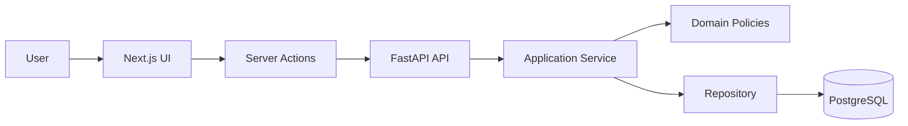
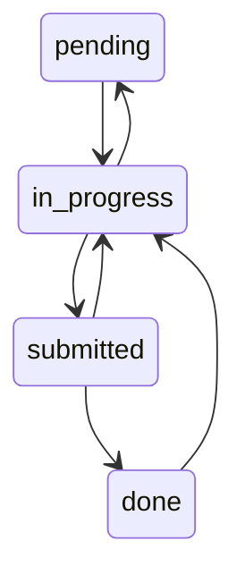
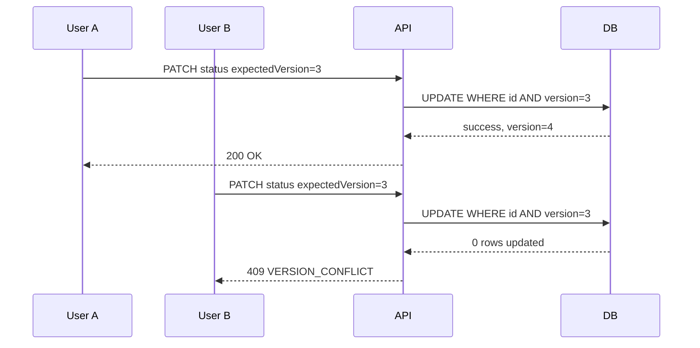

# DECISIONS.md

## 1. Context and goal

This project implements a **Compliance Obligations Tracker** for founders and internal teams. The goal is to track company obligations, due dates, ownership, document requirements, workflow status, and auditability in a domain where small mistakes can be expensive.

The main design principle was:

> Keep the backend as the single source of truth for business rules, and let the frontend present those decisions without re-implementing the domain.

This matters because the most important rules are not UI concerns:

- valid status transitions;

- document-gated submission;

- overdue and due-soon calculation;

- sensitive tax ID masking;

- audit trail;

- concurrency protection.


I prioritized correctness, explainability, and a clean delivery over adding more features.

---

## 2. Architecture overview

The project is split into two applications:

- `backend/`: FastAPI API with Pydantic, async SQLAlchemy, Alembic, and PostgreSQL.

- `frontend/`: Next.js App Router application with React, TypeScript strict, Server Components, Server Actions, and Tailwind.


At a high level:



The backend follows a deliberate separation:

```txt
api/
  HTTP routes, request/response schemas, error mapping

application/
  use cases and orchestration

domain/
  workflow rules, due-date rules, invariants, domain exceptions

infrastructure/
  database models/repositories and PII protection
```

The frontend follows a feature-oriented structure:

```txt
app/
  route-level composition

widgets/
  page-level views such as dashboard and obligation detail

features/
  user actions such as forms, status transitions, document actions

entities/
  obligation types and small domain UI pieces

shared/
  API client, i18n, utilities, primitive UI
```

---

## 3. Backend as the source of truth

### 3.1 State machine

The workflow is a backend-controlled state machine:

```txt
pending -> in_progress
in_progress -> submitted | pending
submitted -> done | in_progress
done -> in_progress
```

Invalid transitions are rejected before persistence. The frontend does not decide whether a transition is valid; it only renders `availableTransitions` returned by the API.



Decision:

> Status transitions are domain behavior, not form behavior.

Alternative discarded:

> Allowing the frontend to freely send any status and validating only through UI state.

Reason:

> That would make the rule easy to bypass and would duplicate domain logic in the browser.

---

### 3.2 Document-gated submission

If an obligation has `requiresDocument = true`, it cannot move to `submitted` without document metadata.

The document rule also lives in the backend. The frontend can show the blocked state, but it is not trusted as the enforcement layer.

Decision:

> The backend validates `requiresDocument` before accepting a transition to `submitted`.

Implementation note:

> After document mutations, the frontend refreshes the current route internally with Next.js revalidation and `router.refresh()`. This is not a browser hard reload or manual F5; it asks Next.js to fetch the latest server-rendered data so `availableTransitions`, document state, and blocked submission messages stay aligned with the backend.

---

### 3.3 Overdue and due soon

`overdue` is derived, not persisted.

The backend calculates:

- `isOverdue`: `dueDate` is before the business date and the obligation is not `submitted` or `done`.

- `isDueSoon`: `dueDate` is within the configured due-soon window and the obligation is not `submitted` or `done`.


`isDueSoon` was added as a practical dashboard signal, but it follows the same principle as `overdue`: it is a read model flag, not a workflow state.

Decision:

> `overdue` and `dueSoon` are backend-owned derived fields.

Reason:

> We wanted one source of truth for time-sensitive compliance risk. If the frontend calculated overdue by itself, two users could see different results depending on timezone, stale code, or browser behavior.

Trade-off:

> For a larger dataset, these flags could be precomputed or moved into optimized database queries. For this scope, calculating them at presentation time is simpler and safer.

---

### 3.4 Sensitive data

`companyTaxId` is accepted on write, but it is not returned raw on reads.

How it is protected:

- The backend uses `cryptography.fernet.Fernet` from the Python `cryptography` package.

- `PII_ENCRYPTION_KEY` is provided through environment configuration, not hardcoded.

- On create/update, `TaxIdProtector.protect()` encrypts the raw tax ID before persistence.

- The backend also stores only the normalized last four alphanumeric characters separately for display masking.

- Read models expose `companyTaxIdMasked` only, built from the stored `last4`.

- API response schemas do not include raw `companyTaxId`.

- The raw value is not written to audit events.


The backend stores the full value protected and exposes only a masked value such as:

```txt
****6789
```

Decision:

> Sensitive tax IDs are write-only from the UI perspective.

Reason:

> The app can preserve the data needed by the system while reducing accidental exposure in the frontend, API responses, screenshots, and logs.

Trade-off:

> Editing an obligation does not repopulate the raw tax ID. If the user wants to change it, they must intentionally enter a new value.

---

### 3.5 Audit trail

Every successful status transition creates one audit event.

The audit trail records:

- previous status;

- next status;

- timestamp;

- changed by;

- obligation version;

- optional reason.


Decision:

> Audit only successful workflow changes, not failed attempts.

Reason:

> For this challenge, the requirement is to show the history of state changes. Failed attempts are useful for security analytics, but they are a different logging/auditing concern.

Scope note:

> The implemented audit trail is intentionally focused on successful status transitions because that is the traceability requirement in the challenge.

---

### 3.6 Concurrency

Mutations over existing obligations use optimistic locking with `expectedVersion`.

The client sends the version it saw. The backend updates only if the current database version still matches. If another request already modified the same obligation, the API returns a conflict.



Decision:

> Use optimistic locking instead of pessimistic locks.

Reason:

> Conflicts should be rare in this small workflow, and optimistic locking keeps the system simple while preventing silent overwrites.

Alternative discarded:

> Last-write-wins updates.

Reason:

> Last-write-wins is dangerous in compliance workflows because it can hide a race condition and leave the audit trail misleading.

---

## 4. API contract and OpenAPI

The API is intentionally explicit instead of exposing only generic CRUD.

Production links:

- Frontend: `https://lazo-takehome.vercel.app/`

- Backend: `https://lazo-backend-two.vercel.app/`

- Swagger: `https://lazo-backend-two.vercel.app/docs`

- OpenAPI runtime: `https://lazo-backend-two.vercel.app/openapi.json`


Versioned OpenAPI snapshot:

```txt
backend/docs/openapi.json
```

Main endpoints:

|Method|Path|Purpose|
|---|---|---|
|`GET`|`/health`|Health check|
|`GET`|`/api/obligations`|Dashboard list|
|`POST`|`/api/obligations`|Create obligation as `pending`|
|`GET`|`/api/obligations/{id}`|Full obligation detail|
|`PATCH`|`/api/obligations/{id}`|Update non-status fields|
|`DELETE`|`/api/obligations/{id}`|Delete obligation|
|`PATCH`|`/api/obligations/{id}/status`|Change workflow status|
|`PUT`|`/api/obligations/{id}/document`|Attach or replace document metadata|
|`DELETE`|`/api/obligations/{id}/document?expectedVersion=...`|Remove document metadata|

Important API decisions:

- status changes have their own endpoint;

- document metadata has its own endpoints;

- existing-resource mutations require `expectedVersion`;

- errors use stable codes;

- list responses are compact;

- detail responses include document metadata and audit history;

- tax ID is always returned masked.


The main domain-sensitive endpoints are the status, document, update, and detail endpoints, because they touch workflow, versioning, auditability, or sensitive data.

---

## 5. Frontend decisions

The frontend is designed to consume backend decisions, not recreate them.

### 5.1 Server Components and Server Actions

Reads are handled through route-level server rendering where possible. Mutations go through Server Actions.

Decision:

> Keep data fetching and mutation orchestration close to the server boundary.

Reason:

> This keeps API credentials/configuration out of browser code, centralizes error handling, and makes refresh/revalidation explicit after mutations.

Implementation note:

> After a successful mutation, Server Actions call `revalidatePath()` and the client can call `router.refresh()` to refresh server-rendered data internally. This keeps the detail and dashboard views synchronized without forcing a browser reload.

---

### 5.2 Detail screen

The obligation detail screen focuses on the fields that matter for a compliance workflow:

- title;

- status;

- risk flags;

- owner;

- due date;

- masked tax ID;

- document requirement;

- document metadata;

- available transitions;

- audit history.


The status area shows the natural workflow order:

```txt
pending -> in_progress -> submitted -> done
```

This is a UX aid only. It does not define valid transitions. Valid actions still come from the backend through `availableTransitions`.

Decision:

> Show the workflow visually while keeping backend-owned transition rules.

Reason:

> Users need to understand where they are in the process, but the UI should not become a second workflow engine.

---

### 5.3 Accessibility

The status transition area was polished to be clearer and more accessible:

- current status is visually marked;

- unavailable states are communicated;

- blocked submission has an explicit reason;

- the transition selector uses clear labels;

- actions are disabled when they cannot be submitted;

- the workflow order is visible without depending only on color.


Decision:

> Treat accessibility as part of the feature, not only visual polish.

---

### 5.4 Documents

Documents are intentionally metadata-only in this version.

The frontend sends:

- file name;

- content type;

- size;

- optional storage key;

- expected version.


It does not upload binary files.

Decision:

> Model the document requirement without implementing real file storage.

Reason:

> The challenge allows a mock document. The important business rule is whether an obligation that requires a document can be submitted, not the storage provider itself.

Trade-off:

> This is not production-ready document management. With more time, I would upload real files to object storage and store signed references.

---

## 6. Testing strategy

The testing strategy focused on behavior and domain rules first.

Backend tests cover the most important parts:

- valid and invalid status transitions;

- document-gated submission;

- due flags;

- API responses;

- audit trail;

- optimistic locking conflict;

- sensitive tax ID masking.


Frontend tests cover user-facing behavior and API contract assumptions:

- dashboard KPIs and filtering;

- forms;

- detail view;

- document actions;

- status actions;

- API error mapping;

- i18n coverage.


Decision:

> Test the rules that would be expensive to get wrong.

Trade-off:

> I did not aim for 100% coverage. I prioritized the paths that prove the domain model, the API contract, and the frontend/backend boundary.

---

## 7. AI usage and corrections

I used AI as part of a Spec-Driven Development workflow.

In this project, Spec-Driven Development meant using the JSON specs as explicit gates before implementation:

1. **Functional spec**: define product behavior, user flows, acceptance criteria, and boundaries without choosing implementation details.

2. **Technical spec**: translate the approved behavior into architecture, API contracts, module boundaries, failure modes, and testing strategy.

3. **Todos spec**: break the approved technical plan into executable tasks with dependencies, outputs, and quality gates.


That is why the repo keeps `functional-spec.json`, `technical-spec.json`, `todos.json`, and the `spec-json-iteration-flow` skill. They are not decorative artifacts; they show how the implementation was constrained before code was written.

Trade-off:

> This workflow takes more time upfront because the specs need review before coding. The benefit is that the final code is easier to evaluate: reviewers can compare the implementation against approved behavior, architecture, and tasks instead of reverse-engineering intent from code alone.

The main workflow was:

```txt
technical challenge
  -> specs
  -> implementation
  -> tests
  -> review/correction
  -> final delivery cleanup
```

I also used a custom project skill in the repo to keep the implementation aligned with the challenge constraints and delivery style.

AI helped mainly with:

- scaffolding repeated structures;

- drafting specs;

- generating UI iterations;

- reviewing consistency between backend and frontend;

- accelerating tests and edge-case discovery;

- debugging deployment assumptions.


However, I did not treat AI output as final. I corrected or rejected it when it produced unclear, oversized, or poorly scoped results.

Concrete examples:

### 7.1 Deployment correction

An AI-assisted deployment pass initially led to a wrong Vercel assumption around where the FastAPI app should be loaded from. Vercel was detecting the wrong app path and expecting a top-level FastAPI `app` instance.

The correction was to align the backend deploy structure so Vercel loads the app through the intended backend entrypoint and configuration.

Decision:

> Deployment instructions and project root configuration must match the actual repo layout, not what the platform guesses.

---

### 7.2 Detail screen correction

An early version of the detail screen followed the specs too loosely and ended up being too vague for the workflow.

The corrected version made the screen more explicit:

- document metadata is visible;

- document removal is available when a document exists;

- status transitions are selected clearly;

- the workflow order is visible;

- blocked submission is explained;

- audit history is shown in context.


Decision:

> The detail screen should be the place where a reviewer can understand and defend the domain behavior.

---

### 7.3 AI verbosity correction

Some AI-generated explanations were too long for the actual project needs.

I reduced the final documentation to the decisions that matter for reviewing the implementation: what was built, why it was built that way, and what would be improved with more time.

Decision:

> Use AI to move faster, but keep the final artifact concise and owned.

---

## 8. If I had more time

### 8.1 Authentication and authorization

I did not implement user authentication, tenant permissions, or role-based access control.

With more time, I would add:

- authenticated users;

- per-client access boundaries;

- role-based permissions;

- audit fields tied to real users;

- tenant isolation at the query level.


Reason for leaving it out:

> The challenge focuses on domain modeling, workflow correctness, sensitive data handling, and explainability. Auth would be important in production, but it would expand the scope significantly.

---

### 8.2 Client-specific domains

I would explore tenant-specific domains or subdomains such as:

```txt
client1.lazo-test.app
client2.lazo-test.app
```

This could make sense for a multi-client compliance product, especially if each company needs a separated workspace experience.

Reason for leaving it out:

> Multi-tenant routing and domain management are infrastructure/product decisions outside the core challenge.

---

### 8.3 Real document upload

Documents are currently mock metadata.

With more time, I would add:

- direct upload to S3 or compatible object storage;

- signed upload URLs;

- signed download URLs;

- file size/type validation;

- malware scanning;

- retention policy;

- document access audit.

Reason for leaving it out:

> The challenge allows mock documents. I focused on the invariant: if a document is required, submission must be blocked until document metadata exists.

---

### 8.4 Document lifecycle audit

The current audit trail focuses on status changes.

With more time, I would add a separate document lifecycle audit for:

- document metadata creation;

- document replacement;

- document deletion;

- who performed the change;

- when it happened;

- which obligation version it affected.


Reason for leaving it out:

> The implemented challenge requirement was status-change auditability. Document lifecycle audit would be valuable in production, but it is a separate audit stream and would need product decisions about retention and file storage.

---

### 8.5 Stronger security posture

With more time, I would improve:

- structured logs with PII redaction tests;

- stricter secret management;

- authorization checks;

- rate limiting;

- security headers;

- tenant isolation tests;

- audit retention policy.


Reason for leaving it out:

> I implemented the most relevant sensitive-data behavior for the challenge: accepting the tax ID on write, protecting it at rest, and exposing only a masked value on read.

---

### 8.6 More production-grade UX taste

The final UI is designed to be clear and usable, but with more time I would polish:

- copy consistency;

- empty states;

- responsive detail layout;

- visual rhythm of workflow cards;

- form density;

- accessibility pass with keyboard-only review;

- final visual taste.


Reason for leaving it out:

> The UI is usable and aligned with the product direction, but the primary delivery priority was a correct and defendable compliance workflow.

---

## 9. Final reflection

The most important decision was to avoid building "just a CRUD".

The project is small, but the domain has high-care constraints:

- dates can change risk;

- documents can block workflow;

- status changes need traceability;

- sensitive data cannot leak;

- concurrent requests cannot silently overwrite each other.


That is why the architecture keeps the domain in the backend, exposes explicit API contracts, and makes the frontend a clear presentation layer over backend-owned decisions.
